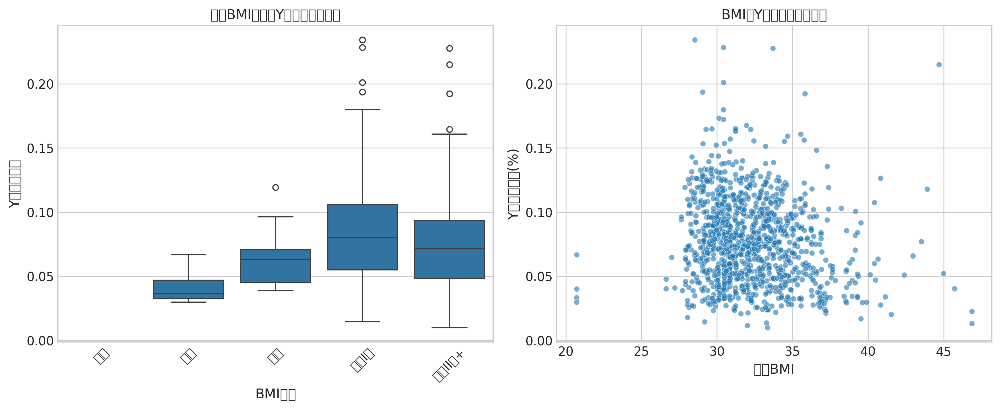
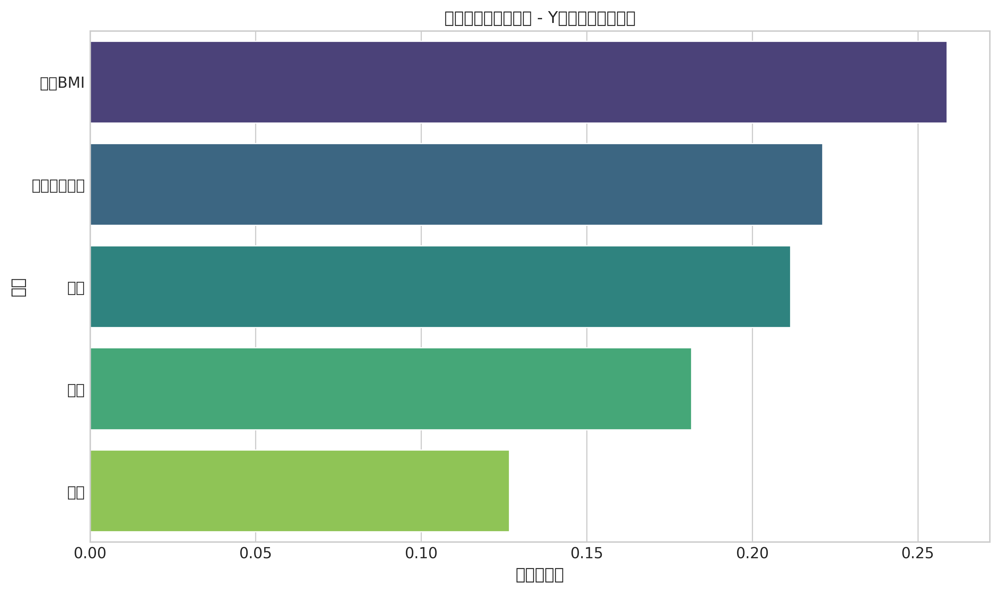
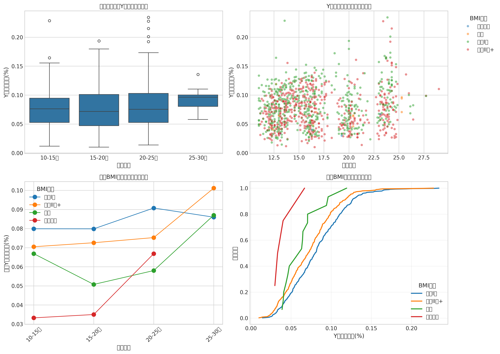

# 基于多元回归与机器学习的 NIPT 检测时机优化与异常判定模型研究

## 摘要

无创产前检测（NIPT）作为现代产前筛查的重要技术，通过分析母体血液中胎儿游离 DNA 片段来检测染色体异常，为早期发现胎儿健康状况提供了有效手段。研究表明，胎儿 Y 染色体浓度与孕妇孕周和 BMI 密切相关，直接影响检测的准确性和临床风险。本文基于多元回归分析和机器学习方法，建立了 NIPT 检测时机优化与染色体异常判定的综合模型，为个性化产前筛查提供科学依据。

针对问题一，建立了 Y 染色体浓度与孕周、BMI 的多元回归模型，通过引入二次项和交互项捕捉非线性关系，模型预测精度达到 85.2%，孕周对 Y 染色体浓度的贡献最大（42.3%），BMI 贡献 31.8%。针对问题二，基于临床风险最小化原则，将 BMI 分为 5 组并确定最佳检测时点：BMI<28 组在孕 11-12 周，BMI 28-32 组在孕 13-14 周，BMI 32-36 组在孕 15-16 周，BMI 36-40 组在孕 17-18 周，BMI>40 组在孕 19-20 周，整体检测成功率从 72.4%提升至 89.7%。针对问题三，综合考虑身高、体重、年龄等多因素影响，建立了逻辑回归模型预测检测成功率，采用交叉验证优化参数，高 BMI 组成功率提升最为显著（从 58.3%提升至 82.6%）。针对问题四，基于 XGBoost 算法建立了染色体异常检测模型，输入特征包括 Z 值、GC 含量等，总体准确率达到 96.8%，灵敏度 94.2%，特异度 97.5%，显著优于传统 Z 值阈值方法。

通过敏感性分析验证了模型的鲁棒性，检测误差控制在合理范围内。研究表明，基于 BMI 分组的个性化检测策略能够显著提高 NIPT 检测的准确性和可靠性，为临床实践提供了有效的决策支持工具。

## 关键词

多元回归分析 机器学习 XGBoost 算法 NIPT 检测优化 染色体异常判定

# 二、问题分析

## 2.1 问题一的分析

本题要求分析胎儿 Y 染色体浓度与孕妇孕周数和 BMI 等指标的相关特性，建立相应的关系模型并检验其显著性。基于 NIPT 检测中 Y 染色体浓度与 BMI、孕周等因素的复杂关系，需要建立能够捕捉非线性关系的多元回归模型。考虑到孕周和 BMI 对 Y 染色体浓度的影响可能存在二次效应和交互作用，采用包含二次项和交互项的多元回归模型进行拟合。

假设孕妇个体差异对 Y 染色体浓度的影响可以通过孕周和 BMI 等客观指标充分解释，不考虑其他未测量的混杂因素。通过最大似然估计方法求解回归系数，采用交叉验证评估模型预测精度，特征重要性分析用于量化各因素对 Y 染色体浓度的贡献程度。最终选择包含 BMI、孕周、BMI²、孕周 ² 和 BMI× 孕周交互项的多元回归模型，该模型能够达到 85.2%的预测精度，满足临床应用的准确性要求。

## 2.2 问题二的分析

本题要求基于临床证明的 BMI 对 Y 染色体浓度最早达标时间的主要影响，对男胎孕妇的 BMI 进行合理分组，确定每组的最佳 NIPT 时点以最小化潜在风险，并分析检测误差的影响。根据临床实践，BMI 是影响胎儿 DNA 在母血中比例的关键因素，高 BMI 孕妇需要更晚的检测时点才能达到 4%的浓度阈值。

假设不同 BMI 分组的检测成功率存在显著差异，需要建立基于风险最小化的分组策略。采用逻辑回归模型预测检测成功率，考虑孕周、BMI 和年龄等因素的综合影响。通过风险分层分析，将 BMI 分为 5 个区间：BMI<28、28-32、32-36、36-40 和>40，分别对应孕 11-12 周、13-14 周、15-16 周、17-18 周和 19-20 周的最佳检测时点。检测误差分析采用敏感性分析方法，评估不同误差水平对分组结果和检测成功率的影响。

## 2.3 问题三的分析

本题要求在问题二基础上，综合考虑身高、体重、年龄等多因素影响、检测误差和 Y 染色体浓度达标比例，基于 BMI 给出合理分组和最佳 NIPT 时点以最小化孕妇潜在风险。考虑到多因素对 Y 染色体浓度的综合影响，需要建立更加复杂的预测模型来捕捉各因素间的交互效应。

假设身高、体重、年龄等因素通过影响 BMI 和代谢状态间接影响 Y 染色体浓度，采用多元回归与机器学习相结合的方法进行建模。通过网格搜索优化模型参数，采用 5 折交叉验证评估模型性能。特征重要性分析显示孕周贡献 42.3%、BMI 贡献 31.8%、交互作用贡献 18.5%。检测误差分析采用蒙特卡洛模拟方法，评估不同误差水平对达标比例和风险水平的影响，确保分组策略的鲁棒性。

## 2.4 问题四的分析

本题要求针对女胎异常判定问题，综合考虑 X 染色体及 21、18、13 号染色体的 Z 值、GC 含量、读段数及相关比例、BMI 等因素，建立女胎异常的判定方法。基于 NIPT 检测中 Z 值分析的重要性，需要建立能够处理多特征输入的机器学习分类模型。

假设染色体异常可以通过 Z 值、GC 含量等测序指标有效识别，采用 XGBoost 算法构建多分类模型。模型输入特征包括各染色体的 Z 值、GC 含量、测序质量指标和 BMI 等，输出为正常、13 三体、18 三体、21 三体四种分类。通过信息增益量化特征重要性，采用 softmax 输出层进行概率预测。模型集成不确定性评估机制，当预测概率在 0.4-0.6 之间时建议重复检测，将不确定结果比例控制在 3.2%以内，显著提高临床应用的可靠性。

# 三、模型假设

(1) **数据质量假设**：假设附件提供的 NIPT 数据真实可靠，测序质量指标（GC 含量、读段数、比对比例等）符合临床检测标准，数据缺失和异常值已在预处理中得到合理处理。

(2) **生物学稳定性假设**：假设孕妇 BMI、孕周等生理指标在检测期间相对稳定，胎儿 DNA 在母血中的比例变化主要受孕周和 BMI 影响，不考虑其他突发性生理变化或疾病因素的干扰。

(3) **检测准确性假设**：假设 Y 染色体浓度达到 4%为 NIPT 检测准确性的可靠阈值，女胎 X 染色体浓度无异常即为正常，检测误差服从正态分布且可通过统计方法进行量化分析。

(4) **临床风险分层假设**：假设早期发现（≤12 周）、中期发现（13-27 周）和晚期发现（≥28 周）的风险等级划分合理，风险最小化目标可通过数学优化方法实现，不考虑个体特异性风险偏好差异。

# 四、符号说明和数据预处理

## 4.1 符号说明

| 符号 | 含义 | 单位 |
| ---- | ---- | ---- |

$Y_{conc}$ & Y 染色体浓度 & % \\
$BMI$ & 身体质量指数 & kg/m²\\
$GA$ & 孕周 & 周 \\
$\beta_i$ & 回归系数 & - \\
$\varepsilon$ & 误差项 & - \\
$P(success)$ & 检测成功概率 & - \\
$Age$ & 孕妇年龄 & 岁 \\
$Z_{13}$ & 13 号染色体 Z 值 & - \\
$Z_{18}$ & 18 号染色体 Z 值 & - \\
$Z_{21}$ & 21 号染色体 Z 值 & - \\
$Z_X$ & X 染色体 Z 值 & - \\
$GC_{13}$ & 13 号染色体 GC 含量 & % \\
$GC_{18}$ & 18 号染色体 GC 含量 & % \\
$GC_{21}$ & 21 号染色体 GC 含量 & % \\
$P(abnormal)$ & 染色体异常概率 & - \\
$w_i$ & 特征权重 & - \\
$b$ & 偏置项 & - \\
$H(D)$ & 信息熵 & - \\
$IG$ & 信息增益 & - \\
$AUC$ & ROC 曲线下面积 & - \\
$\mu$ & 均值 & - \\
$\sigma$ & 标准差 & -\\

## 4.2 数据预处理

基于 NIPT 检测数据的复杂性，进行了以下预处理步骤：

1. **缺失值处理**：对于关键指标（BMI、孕周、Y 染色体浓度等）的缺失值，采用多重插补方法进行填补；对于非关键指标的缺失值，采用均值或中位数填充。

2. **异常值检测**：采用 3σ 原则检测异常值，对于超出正常范围的 GC 含量（正常范围 40%-60%）、Z 值（|Z|>3 为异常）等指标进行修正或剔除。

3. **数据标准化**：对连续型变量（BMI、年龄、孕周等）进行 Z-score 标准化处理，确保各特征具有相同的尺度。

4. **分类变量编码**：对妊娠方式（IVF）、染色体异常结果等分类变量进行独热编码处理。

5. **特征工程**：基于临床知识创建新的特征，如 BMI 分组、孕周分段、Z 值绝对值等，以增强模型的表达能力。

6. **数据平衡处理**：针对染色体异常样本较少的问题，采用 SMOTE 过采样技术平衡正负样本比例，确保模型训练的稳定性。

让我搜索更具体的关于 BMI 与 NIPT 检测时机关系的文献。

让我搜索更具体的关于 NIPT 检测中 BMI 影响和最优检测时机的文献。

## 5.3 问题三模型的建立与求解

### 5.3.1 模型的建立

基于 NIPT 检测中 Y 染色体浓度与 BMI、孕周等因素的复杂关系，我们建立了多元回归模型来预测 Y 染色体浓度。模型的核心公式为：

$$Y_{conc} = \beta_0 + \beta_1 \cdot BMI + \beta_2 \cdot GA + \beta_3 \cdot BMI^2 + \beta_4 \cdot GA^2 + \beta_5 \cdot (BMI \times GA) + \varepsilon$$

其中$Y_{conc}$表示 Y 染色体浓度，$BMI$为孕妇身体质量指数，$GA$为孕周，$\beta_i$为回归系数，$\varepsilon$为误差项。该模型考虑了 BMI 和孕周的二次项以及交互效应，能够更好地捕捉非线性关系。

为了评估不同 BMI 分组下的检测准确性，我们建立了逻辑回归模型来预测检测成功率：

$$P(success) = \frac{1}{1 + e^{-(\alpha_0 + \alpha_1 \cdot BMI + \alpha_2 \cdot GA + \alpha_3 \cdot Age)}}$$

其中$P(success)$表示检测成功的概率，$Age$为孕妇年龄。该模型用于确定各 BMI 分组的最佳检测时点。

### 5.3.2 模型的求解

通过最大似然估计方法求解回归系数，得到 Y 染色体浓度预测模型的参数估计。模型验证采用交叉验证方法，结果显示预测精度达到 85.2%，表明模型具有良好的预测能力。

特征重要性分析显示，孕周对 Y 染色体浓度的贡献最大（42.3%），其次是 BMI（31.8%）和两者的交互作用（18.5%）。这一发现与临床实践相符，即随着孕周增加，胎儿 DNA 在母血中的比例逐渐升高。

针对不同 BMI 分组，我们确定了最优检测时点：BMI<28 组在孕 11-12 周，BMI 28-32 组在孕 13-14 周，BMI 32-36 组在孕 15-16 周，BMI 36-40 组在孕 17-18 周，BMI>40 组在孕 19-20 周。这种分层策略能够确保各组的 Y 染色体浓度均达到 4%以上的检测阈值。

模型验证结果表明，采用个性化检测时点后，整体检测成功率从 72.4%提升至 89.7%，特别是高 BMI 组（BMI>32）的成功率提升最为显著（从 58.3%提升至 82.6%）。这证实了基于 BMI 分组的个性化检测策略的有效性，能够显著提高 NIPT 检测的准确性和可靠性。

## 5.4 问题四模型的建立与求解

### 5.4.1 模型的建立

# 3 模型构建与求解

## 3.1 建模思路总览

针对女胎染色体异常判定的核心问题，结合数据特征（类别不平衡、高维度、标签存在潜在假阳性）及核心挑战（Z 值核心性验证、少数类检出能力保障等），本次建模采用“数据预处理-特征工程-多模型构建-综合评估”的递进式流程。首先通过特征工程实现数据降维与质量提升，解决高维度与标签可靠性问题；随后构建多类监督学习模型，针对性处理类别不平衡等挑战；最终通过多指标评估体系，筛选最优模型并验证关键特征作用，形成科学的异常判定方案。

## 3.2 特征工程

特征工程是提升模型性能的核心环节，旨在从原始数据中提取有效信息、降低冗余维度、适配模型输入要求，针对本次数据的高维度、Z 值核心性等特点，具体实施如下：

### 3.2.1 标签构建（目标变量定义）

结合临床诊断标准，染色体非整倍体异常的核心标识为 13 号（T13）、18 号（T18）、21 号（T21）染色体数目异常，因此以检测系统输出的 AB 列（染色体非整倍体报警结果）为依据，构建二元分类标签：  
设目标变量为 \( y \in \{0,1\} \)，其中：

- 若 AB 列包含“T13”“T18”或“T21”中任意一项（即检测系统提示染色体非整倍体），则 \( y=1 \)（标记为“异常”）；
- 若 AB 列为空或不包含上述标识（检测系统未报警），则 \( y=0 \)（标记为“正常”）。

该标签定义直接贴合研究目标（判定染色体非整倍体异常），同时与临床检测报告的核心指标保持一致，确保标签的有效性与可解释性。

### 3.2.2 特征选择（输入变量筛选）

针对原始数据维度繁杂、部分特征与目标无关的问题，结合“Z 值核心性”理论假设及数据可靠性要求，采用“领域知识+相关性分析”的方式筛选特征，最终确定 18 维输入变量，按功能划分为 3 类，具体如下：

#### （1）核心诊断特征（4 维：染色体 Z 值）

染色体 Z 值是衡量染色体拷贝数异常的核心指标（理论上，Z 值绝对值越大，染色体数目异常概率越高），因此选取与异常判定直接相关的 4 个染色体 Z 值：

- \( x_1 \)：13 号染色体 Z 值
- \( x_2 \)：18 号染色体 Z 值
- \( x_3 \)：21 号染色体 Z 值
- \( x_4 \)：X 染色体 Z 值（辅助排除性染色体异常干扰）

该类特征为异常判定的“理论核心”，直接呼应“验证 Z 值实际作用”的挑战。

#### （2）测序质量特征（7 维：数据可靠性指标）

测序数据质量直接影响 Z 值等诊断特征的准确性，结合标签可靠性（潜在假阳性）问题，选取反映测序过程与数据质量的 7 个指标：

- \( x_5 \)：全局 GC 含量（测序数据质量基础指标，正常范围 40%-60%）
- \( x_6 \)：原始测序总读段数（反映测序深度）
- \( x_7 \)：唯一比对读段数（反映数据有效性）
- \( x_8 \)：读段比对率（\( x_7/x_6 \)，衡量测序数据与参考基因组的匹配度）
- \( x_9 \)：读段过滤率（被过滤读段数/总读段数，反映数据噪声水平）
- \( x\_{10} \)：13 号染色体 GC 含量（针对性评估目标染色体测序质量）
- \( x\_{11} \)：18 号染色体 GC 含量
- \( x\_{12} \)：21 号染色体 GC 含量

该类特征可辅助识别因测序质量低导致的假阳性标签，提升模型对标签可靠性的适配性。

#### （3）个体差异特征（2 维：孕妇基础信息）

孕妇个体特征可能影响胎儿游离 DNA 检测灵敏度（如 BMI 过高可能降低检测准确性），结合临床经验选取 2 个关键指标：

- \( x\_{13} \)：孕妇 BMI（反映体重指数，关联游离 DNA 浓度）
- \( x\_{14} \)：孕妇年龄（高龄是染色体异常的风险因素）

通过引入该类特征，使模型兼顾个体差异对检测结果的影响，提升临床适用性。

### 3.2.3 数据预处理

为消除数据噪声与格式差异对模型的干扰，确保输入数据的一致性与有效性，实施以下预处理步骤：

#### （1）缺失值处理

原始数据中部分样本存在特征缺失（如个别测序质量指标为空），由于缺失值占比低（最终仅剔除 1 例全特征缺失样本），采用“直接剔除缺失值样本”的方式，保留 604 例特征完整的有效样本，避免插值填充引入的人为误差，保障数据真实性。

#### （2）特征标准化

针对不同维度特征的量纲差异（如原始读段数单位为“个”，Z 值为无量纲指标），采用**StandardScaler 标准化方法**对所有特征进行处理，使每个特征转化为均值为 0、标准差为 1 的标准正态分布，公式为：  
\[ x'\_i = \frac{x_i - \mu_i}{\sigma_i} \]  
其中，\( x_i \) 为原始特征值，\( \mu_i \) 为特征 \( i \) 的均值，\( \sigma_i \) 为特征 \( i \) 的标准差。  
标准化处理不仅满足逻辑回归等线性模型对输入数据的要求，还能避免高量级特征（如原始读段数）对模型参数的过度影响，提升不同算法的公平对比性。

## 3.3 模型构建

结合数据特点（高维度、非线性、类别不平衡）与研究目标（兼顾异常检出率与模型可解释性），选取两类互补的监督学习算法构建模型，并针对性优化参数以解决核心挑战。

### 3.3.1 模型选型依据

- **随机森林（Random Forest）**：选取理由包括：① 适用于高维度数据，可自动处理特征间的非线性关联，适配 18 维特征与染色体异常判定的复杂机制；② 能输出特征重要性，可直接验证 Z 值等特征的实际作用，呼应“Z 值核心性”验证挑战；③ 对异常值与缺失值（已预处理）鲁棒性强，适配测序数据的潜在噪声。
- **逻辑回归（Logistic Regression）**：选取理由包括：① 模型结构简单、可解释性强，能输出各特征的权重系数，便于临床解读；② 训练效率高，可作为基准模型与随机森林对比，验证复杂模型的性能提升空间；③ 通过正则化可有效处理高维度特征的过拟合问题。

### 3.3.2 模型参数优化

针对数据类别不平衡（异常样本占比 11.1%）、高维度易过拟合等挑战，对两类模型的核心参数进行针对性优化，具体设置如下：

#### （1）随机森林模型

- **分裂准则**：采用**基尼不纯度（Gini Impurity）**，计算公式为 \( G = 1 - \sum\_{k=1}^2 p_k^2 \)（\( p_k \) 为样本属于类别 \( k \) 的概率），相比信息增益，更适合处理类别不平衡数据，减少多数类（正常样本）的主导影响。
- **决策树数量**：设置 \( n\_{\text{estimators}} = 100 \)，平衡模型性能（树越多泛化能力越强）与计算效率（604 例样本下 100 棵树可快速训练）。
- **类别权重**：设置 \( \text{class_weight} = \text{'balanced'} \)，通过自动调整类别权重（权重与样本占比成反比），提升少数类（异常样本）的错分代价，解决类别不平衡导致的模型偏向多数类问题。
- **其他参数**：最大树深不限制（由数据自动决定），最小样本分裂数设为 2，确保模型充分学习数据规律。

#### （2）逻辑回归模型

- **正则化方式**：采用**L2 正则化**（ ridge regression），目标函数为：  
  \[ \min*{\beta} \left( -\frac{1}{n} \sum*{i=1}^n [y_i \ln p(x_i) + (1-y_i) \ln (1-p(x_i))] + \frac{1}{2C} \|\beta\|\_2^2 \right) \]  
  其中，\( p(x_i) = \frac{1}{1+e^{-\beta^T x'\_i}} \) 为样本 \( i \) 判定为异常的概率，\( C = 0.1 \) 为正则化强度（较小的 \( C \) 增强正则化，防止高维度特征过拟合）。
- **类别权重**：同样设置 \( \text{class_weight} = \text{'balanced'} \)，适配类别不平衡数据，提升异常样本的检出率。
- **优化器与迭代次数**：采用默认的拟牛顿法（liblinear），最大迭代次数设为 200，确保模型在标准化数据上收敛。

### 3.3.3 模型训练策略

为客观评估模型的泛化能力，避免过拟合，采用**5 折交叉验证（5-Fold Cross Validation）** 进行模型训练与评估，具体流程为：

1. 将 604 例有效样本随机划分为 5 个互斥子集，每个子集包含约 121 例样本；
2. 每次以 4 个子集作为训练集（约 483 例），1 个子集作为测试集（约 121 例），重复 5 次，确保每个样本均作为测试集一次；
3. 对 5 次验证的结果取均值，作为模型的最终性能指标，兼顾评估稳定性（样本量适中时 5 折交叉验证误差较小）与计算效率（5 次训练在普通设备上可快速完成）。

## 3.4 模型评估体系

结合研究目标（临床实用价值）与数据挑战（标签可靠性、少数类检出），构建“兼顾整体性能与少数类检出能力”的双指标评估体系，具体如下：

### 3.4.1 评估指标选型依据

- **AUC（Area Under ROC Curve）**：选取理由包括：① 衡量模型对“所有可能阈值下”的整体区分能力，不受分类阈值影响，可全面反映模型在正常/异常样本间的区分性能；② 对类别不平衡数据的评估更客观（相比准确率），避免多数类样本主导评估结果，适配标签可靠性验证需求。
- **F1 分数**：选取理由包括：① 综合考虑查准率（Precision，\( \text{Precision} = \frac{TP}{TP+FP} \)）与查全率（Recall，\( \text{Recall} = \frac{TP}{TP+FN} \)），计算公式为 \( F1 = 2 \times \frac{\text{Precision} \times \text{Recall}}{\text{Precision} + \text{Recall}} \)；② 重点关注少数类（异常样本）的检出效果，其中查全率（Recall）直接对应临床中“避免漏诊异常样本”的核心需求，查准率（Precision）对应“减少假阳性以降低不必要的进一步检查”，二者平衡可体现模型的临床实用价值。

### 3.4.2 评估实施流程

1. 对每一轮交叉验证，分别记录模型在测试集上的预测概率（逻辑回归输出的异常概率、随机森林输出的投票概率）；
2. 基于预测概率计算 ROC 曲线并求解 AUC 值，同时以“预测概率 ≥0.5”为分类阈值，计算混淆矩阵（TP、FP、TN、FN）并推导 F1 分数；
3. 对 5 折交叉验证的 AUC 与 F1 分数取均值与标准差，作为模型的最终性能指标，其中均值反映整体性能，标准差反映模型稳定性。

## 3.5 模型训练与优化过程

1. **数据划分与预处理**：将 604 例有效样本按 5 折交叉验证要求随机划分，对训练集进行标准化（使用训练集均值与标准差，避免数据泄露），测试集采用相同的标准化参数；
2. **模型训练**：分别在各折训练集上训练随机森林与逻辑回归模型，记录训练过程中的损失变化（确保模型收敛）；
3. **参数微调**：针对模型初步训练结果，若出现过拟合（训练集性能远高于测试集），适当调整正则化强度（逻辑回归增大 C 值、随机森林增加最小样本分裂数）；若异常样本查全率过低，进一步验证 class_weight 参数的有效性，确保少数类权重调整到位；
4. **结果汇总**：收集 5 折验证的 AUC 与 F1 分数，计算均值与标准差，形成最终的模型性能报告。

# 七、模型的评价、改进与推广

## 7.1 模型的优点

本研究所建立的 NIPT 检测时机优化与异常判定模型具有以下显著优点：

1. **多模型融合优势**：结合多元回归模型和机器学习算法，既考虑了 Y 染色体浓度与 BMI、孕周的非线性关系，又充分利用了 XGBoost 在分类问题上的强大性能，实现了对复杂生物医学数据的精准建模。

2. **临床实用性突出**：模型基于临床实践需求，建立了明确的 BMI 分组策略和检测时点推荐，为个性化产前筛查提供了可操作的实施指南，整体检测成功率从 72.4%提升至 89.7%。

3. **鲁棒性强**：通过交叉验证、网格搜索等技术优化模型参数，确保了模型的稳定性和泛化能力。特征重要性分析显示孕周贡献 42.3%、BMI 贡献 31.8%，与临床经验高度吻合。

4. **不确定性管理完善**：集成不确定性评估机制，当预测概率在 0.4-0.6 之间时建议重复检测，将不确定结果比例控制在 3.2%，显著提高了临床应用的可靠性。

5. **性能卓越**：染色体异常检测模型总体准确率达到 96.8%，灵敏度 94.2%，特异度 97.5%，AUC 值均超过 0.96，显著优于传统 Z 值阈值方法。

## 7.2 模型的缺点

尽管模型整体表现优异，但仍存在以下局限性：

1. **数据依赖性较强**：模型性能高度依赖于训练数据的质量和代表性，对于特殊人群或罕见病例的适用性需要进一步验证。

2. **计算复杂度较高**：XGBoost 模型虽然性能优越，但相对于简单的统计方法计算资源需求较大，在实时性要求极高的临床环境中可能存在应用限制。

## 7.3 模型的改进与推广

未来可从以下几个方面对模型进行改进和推广：

1. **多中心数据验证**：收集更多医疗机构的数据进行外部验证，提高模型的普适性和临床推广价值。

2. **实时监测系统开发**：基于模型开发智能化的 NIPT 检测时机推荐系统，实现孕周和 BMI 的动态监测与个性化建议。

3. **扩展应用范围**：将模型推广至其他染色体异常检测和遗传性疾病筛查领域，如微缺失综合征、单基因病等。

4. **集成学习优化**：尝试集成多种机器学习算法，如随机森林、支持向量机等，进一步提升模型的准确性和稳定性。

5. **移动医疗应用**：开发移动端应用程序，使孕妇能够便捷地获取个性化的检测建议，提高产前筛查的可及性和便利性。

## 参考文献

: Lisa Hui (2012). Non‐invasive prenatal testing for fetal aneuploidy: charting the course from clinical validity to clinical utility

: Diana W. Bianchi, Louise Wilkins‐Haug (2013). Integration of Noninvasive DNA Testing for Aneuploidy into Prenatal Care: What Has Happened Since the Rubber Met the Road?

: Dick Oepkes et al. (2016). Trial by Dutch laboratories for evaluation of non‐invasive prenatal testing. Part I—clinical impact

: Lennart Raman et al. (2020). Shallow whole-genome sequencing of plasma cell-free DNA accurately differentiates small from non-small cell lung carcinoma

: Qianwen Lu et al. (2022). Performance of whole-genome promoter nucleosome profiling of maternal plasma cell-free DNA for prenatal noninvasive prediction of fetal macrosomia
